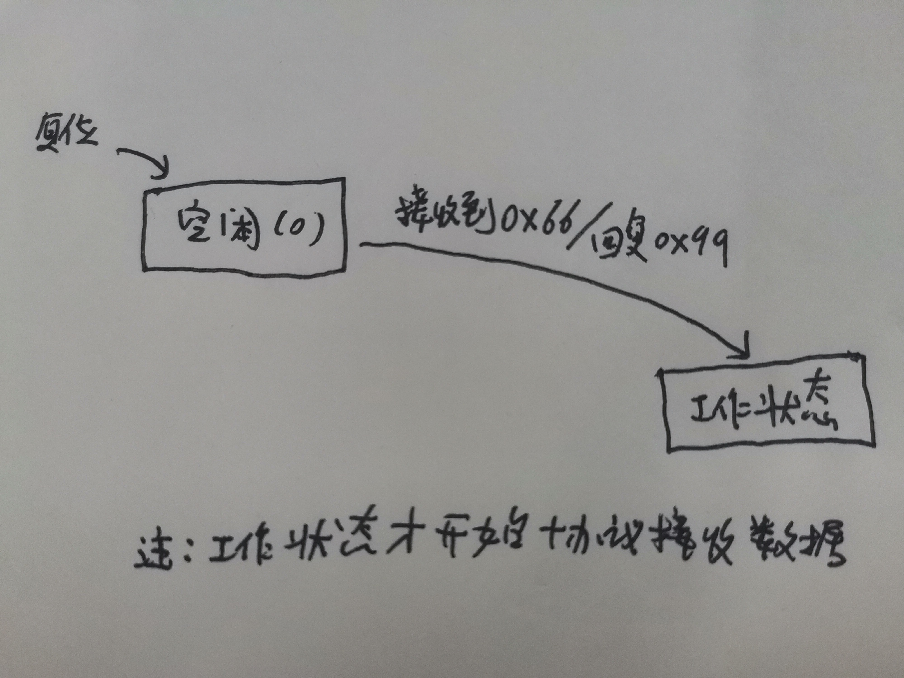

# 自制通信数据协议
## 数据协议帧
下面是通讯协议的数据帧格式:  
帧头1|帧头2|数据长度|数据|校验码  
:-:|:-:|:-:|:-:|:-:   
0X3A|0X5C|N|...|code  
8位|8位|8位|N个字节|8位  
说明：  
- **帧头** 0X3A5C的16位无符号数  
- **数据长度** 数据长度不包括*帧头*，*数据长度*，*校验码*，单位为字节
- **校验码** 所有的数据连续异或的结果

## 串口状态
下面是串口状态的流程图  

## 发送数据  
发送数据与接收数据相互独立  
- `usart_sendData`是已经封装好的函数，把串口，数据首地址和长度入参即可按协议传输数据  
- `usart_sendByte`是不带协议的发送一个字节的函数  
- `usart_sendString`是不带协议的发送字符串的函数  
- `READ_COM(type,addr)`是对以addr为首地址的内存按某种数据类型type读取  

